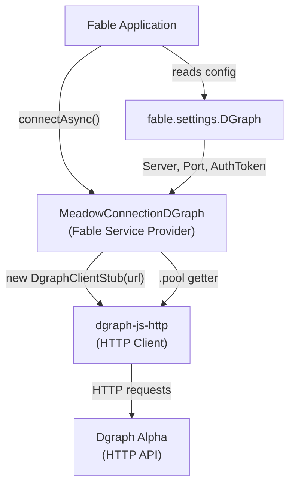
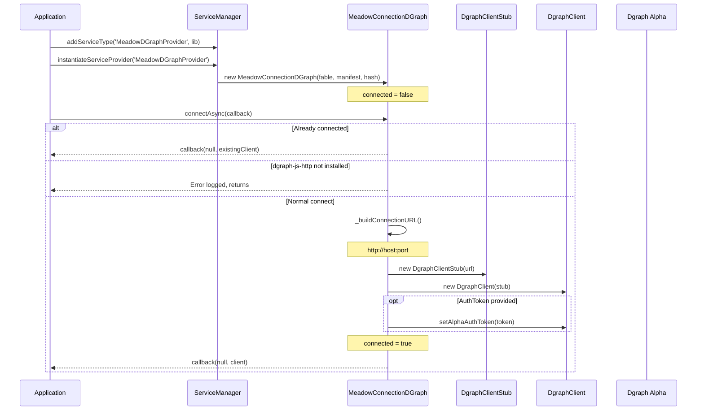
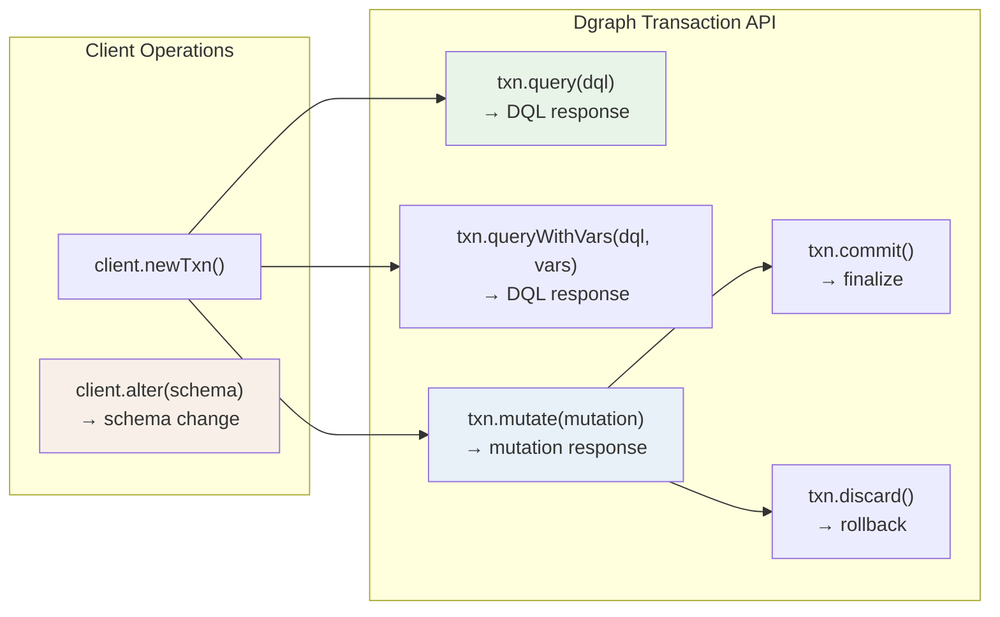
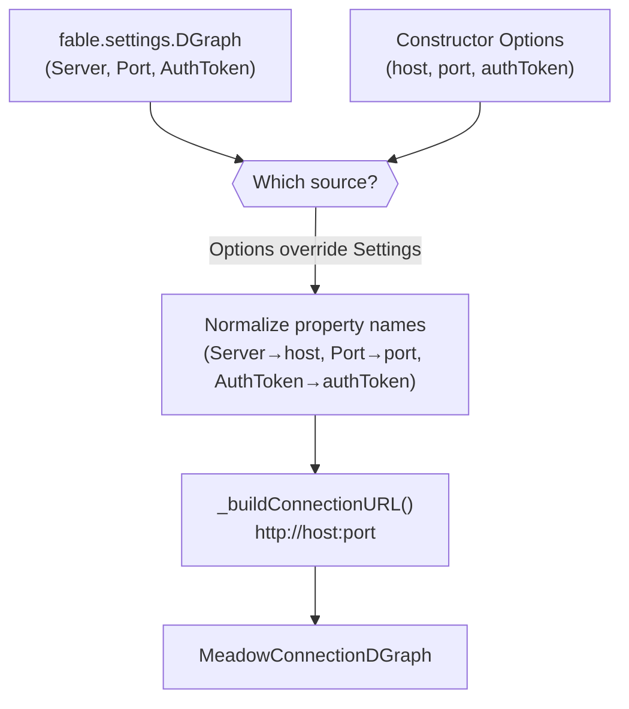
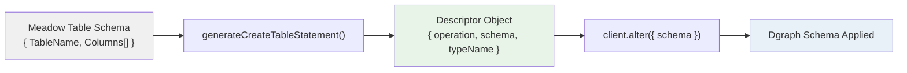
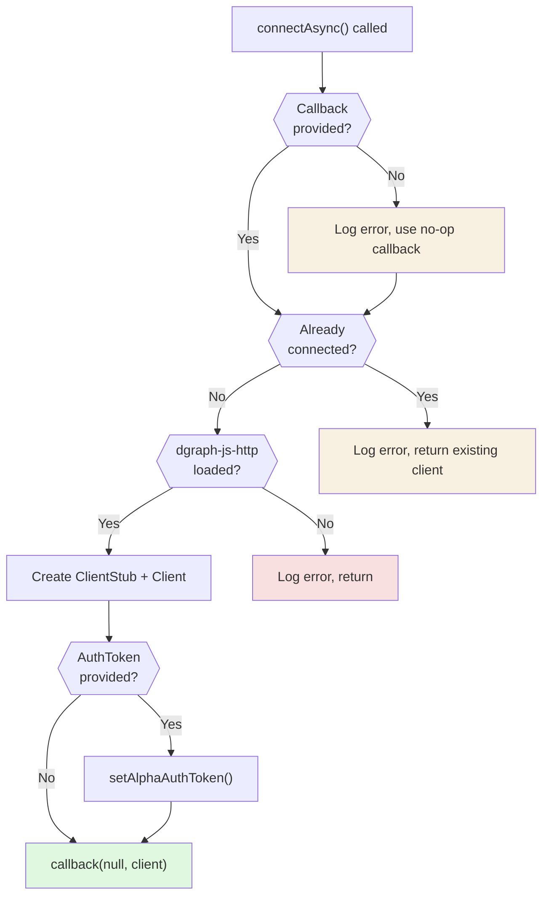

# Architecture & Design

Meadow Connection Dgraph connects Fable applications to Dgraph graph databases through the service provider pattern. This page illustrates the system architecture, connection lifecycle, query model, and how the provider fits into the Meadow ecosystem.

---

## System Architecture

---

## Connection Lifecycle

---

## Query and Mutation Model

Unlike SQL-based Meadow connectors, Dgraph uses a transaction-based model. The provider exposes the client; all operations happen through transactions:

### Operation Types

| Operation | Method | Description |
|-----------|--------|-------------|
| DQL Query | `txn.query(dql)` | Read data using DQL |
| Query with Variables | `txn.queryWithVars(dql, vars)` | Parameterized queries |
| Mutation | `txn.mutate({ setJson })` | Insert or update nodes |
| Delete | `txn.mutate({ deleteJson })` | Remove nodes or edges |
| Commit | `txn.commit()` | Finalize the transaction |
| Discard | `txn.discard()` | Abort the transaction |
| Schema Alter | `client.alter({ schema })` | Apply predicate and type definitions |
| Drop All | `client.alter({ dropAll: true })` | Drop all data and schema |

---

## Connection Settings Flow

Settings priority:

1. **Constructor options** — passed as the second argument to `instantiateServiceProvider()`
2. **Fable settings** — `fable.settings.DGraph`

Both Meadow-style (`Server`, `Port`, `AuthToken`) and lowercase (`host`, `port`, `authToken`) property names are supported. Meadow-style names are normalized to lowercase during construction.

---

## Schema Generation Flow

The `generateCreateTableStatement()` method translates a Meadow table schema into Dgraph predicate declarations and a type definition:

Each Meadow column becomes a Dgraph predicate with an appropriate type and index:

| Meadow DataType | Dgraph Type | Index Directive |
|-----------------|-------------|-----------------|
| `ID` | `int` | `@index(int)` |
| `GUID` | `string` | `@index(exact)` |
| `ForeignKey` | `int` | `@index(int)` |
| `Numeric` | `int` | `@index(int)` |
| `Decimal` | `float` | `@index(float)` |
| `String` | `string` | `@index(exact, term)` |
| `Text` | `string` | `@index(fulltext)` |
| `DateTime` | `datetime` | `@index(hour)` |
| `Boolean` | `int` | `@index(int)` |

See [Schema & Predicates](schema.md) for full details.

---

## Connection Safety

The provider guards against:

- **Missing callback** -- Logs an error and substitutes a no-op callback
- **Double connect** -- Logs an error and returns the existing client
- **Missing library** -- Logs an error if `dgraph-js-http` is not installed

---

## Dgraph vs SQL Architecture

Unlike SQL-based Meadow connectors, Dgraph is a graph database with a fundamentally different data model:

| Concept | SQL Connectors | Dgraph Connector |
|---------|----------------|-------------------|
| **Data model** | Tables with rows and columns | Nodes with predicates and edges |
| **Query language** | SQL | DQL (Dgraph Query Language) |
| **Schema** | CREATE TABLE with columns | Predicate declarations + type definitions |
| **Primary key** | Auto-increment integer | UID (assigned by Dgraph) |
| **Relationships** | Foreign keys + JOINs | Edges between nodes |
| **Transactions** | Connection pool based | Client transaction objects |
| **Connection** | TCP pool | HTTP client stub |
| **Index types** | B-tree, hash | int, float, exact, term, fulltext, hour |

---

## Connector Comparison

| Feature | Dgraph | MySQL | MSSQL | SQLite | RocksDB |
|---------|--------|-------|-------|--------|---------|
| **Database Type** | Graph | Relational | Relational | Relational | Key-Value |
| **Server Required** | Yes | Yes | Yes | No | No |
| **Protocol** | HTTP | TCP | TDS | File I/O | File I/O |
| **Query API** | Transaction-based | Callback | Promise | Synchronous | Callback |
| **Query Language** | DQL | SQL | T-SQL | SQL | Key-Value |
| **Schema Format** | Predicates + Types | CREATE TABLE | CREATE TABLE | CREATE TABLE | None |
| **Auto-increment** | UID (Dgraph) | AUTO_INCREMENT | IDENTITY | AUTOINCREMENT | N/A |
| **Index Control** | Per-predicate | Per-column | Per-column | Per-column | Built-in |
| **Auth Support** | Alpha auth token | User/password | User/password | None | None |
| **Native Driver** | dgraph-js-http | mysql2 | mssql (Tedious) | better-sqlite3 | @nxtedition/rocksdb |
| **Best For** | Graph traversals | Production OLTP | Enterprise | Local/embedded | High-throughput KV |
